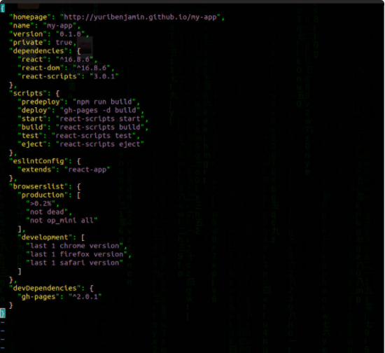
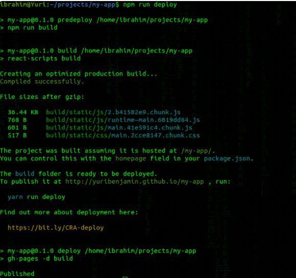

# Chapter_18_DeployReact

### Prerequisites :

- GitHub Account.

- Install Git in your machine and Set up Git.

### Make sure you have Node.js and Npm installed in your machine.

- Install Node.js

- Install Npm

### Procedure

1- First create a repository named my-app using create-react-app.

```npm init react-app my-app```

2- We need to install GitHub Pages package as a dev-dependency.

```angular2svg
cd my-app
npm install gh-pages --save-dev
```

3- Add properties to package.json file.



4- Push source code to github repository

```angular2svg
git add .
git commit -m "first commit"
git push origin head
```

5- Deploy source code to github repository

```angular2svg
npm run deploy
```


6- Visit website

```angular2svg
http://anhtbok92.github.io/Chapter_18_DeployReact
```